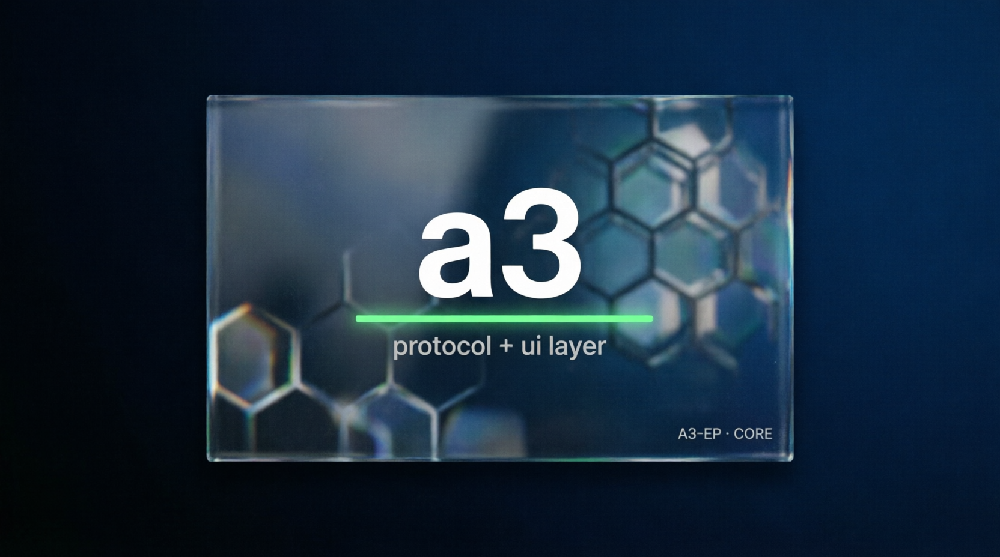

# A3 — keep what your agent believes separate from what it did



[](LICENSE) [](https://github.com/valeriobitzone-png/a3/actions/workflows/ci.yml)

Your agent calls a tool. The tool answers `{"ok": true}`. The agent tells the user "done". Nothing happened.

That answer is a **receipt**: proof that the call returned, not proof that the world changed. A3-EP is a small protocol that stops an agent from turning receipts into beliefs. It keeps three things apart:

- **BELIEF** — what the agent holds true, with a truth class (FACT, OBSERVATION, HYPOTHESIS, UNKNOWN) and where it came from;
- **ACTION** — what it asked for and what the tool answered;
- **ENVIRONMENT** — what was actually observed in the world.

A receipt is OBSERVATION whatever it says (`SUCCESS`, `OK`, `200`, `{"ok": true}`). A FACT needs an independent check of the world. An implementation that emits FACT from a receipt is rejected with code **CF-001**.

## See it in 2 minutes

Requirements: `git` and Python 3.9 or newer. No other dependency, no account, no network after the clone.

```bash
git clone --depth 1 https://github.com/valeriobitzone-png/a3.git
cd a3
python3 examples/receipt-is-not-fact/demo.py
```

You should see three runs of the same task, "email invoice INV-7":

```text
RUN 1 · naive agent · tool has a bug
  tool answered   {"ok": true, "message_id": "msg-001"}
  agent believes  FACT: invoice INV-7 was emailed to anna@example.com
  agent says      "Done: the invoice was sent."
  the world       outbox empty   <- the agent believes something false

RUN 2 · agent with A3 · same buggy tool
  A3              REJECTED CF-001: FACT from an execution receipt (a receipt is OBSERVATION whatever it contains)
  recorded as     OBSERVATION (receipt:sha256:d8acb0801c6dd17b)
  check outbox    NOT FOUND
  agent says      "The tool answered ok, but the email is not in the outbox. Not marking it as sent."

RUN 3 · agent with A3 · working tool
  A3              REJECTED CF-001: ...
  check outbox    FOUND
  A3              FACT (ref ver-msg-002)
  agent says      "Sent, and verified in the outbox."
```

The full expected output is in [`examples/receipt-is-not-fact/expected_output.txt`](examples/receipt-is-not-fact/expected_output.txt); `--json` prints the same runs as data. The demo exits 0 only if A3 behaved as specified. Read [`demo.py`](examples/receipt-is-not-fact/demo.py) (about 150 lines) to see where A3 sits in the agent loop.

## Use it in your agent

The Python package `python/a3ep` is standard library only. Save this as `agent.py` in the `a3` folder and run `python3 agent.py`, then swap the two stub functions for your own tool and your own check:

```python
import sys; sys.path.insert(0, "python")          # or copy python/a3ep into your project
from a3ep import A3Reject, Receipt, Verification, admit

def send_email(to, body):                         # your tool: this one answers ok and sends nothing
    return {"ok": True, "message_id": "msg-001"}

def outbox_contains(message_id):                  # your own check of the world
    return False

result = send_email("anna@example.com", "Invoice INV-7")
print(admit("OBSERVATION", basis=Receipt.of(result)).truth_class)    # lawful: the tool answered
try:
    admit("FACT", basis=Receipt.of(result))                          # the shortcut
except A3Reject as e:
    print("refused", e.code)
if outbox_contains(result["message_id"]):
    print(admit("FACT", basis=Verification("ver-1", "outbox:msg-001", "REAL")).truth_class)
else:
    print("not verified: do not tell the user it was sent")
```

It prints:

```text
OBSERVATION
refused CF-001
not verified: do not tell the user it was sent
```

`admit` also rejects FACT from a sandbox check (CF-002), FACT with no verification (CF-003), UNKNOWN with an invented conclusion (CF-005), and a missing or unknown truth class or provenance (TR-003). Nothing is defaulted silently.

Other languages: [a3-go](https://github.com/valeriobitzone-png/a3-go) (`go get github.com/valeriobitzone-png/a3-go`), [a3-ts](https://github.com/valeriobitzone-png/a3-ts) (TypeScript, from source), and the Kotlin modules in `core/`.

## Check that it holds

```bash
python3 conformance/src/test/python/test_conformance.py   # shared vectors and category rejects
python3 python/tests/test_a3ep.py                         # the Python package against the same corpus
python3 tools/readme_gate.py                              # every command in this README, run literally
```

CF-001 is tested as a property, not a string: [`conformance/fixtures/receipt-forms.json`](conformance/fixtures/receipt-forms.json) holds 18 receipt forms (exit codes, printed text, JSON, HTTP bodies, an MCP tool result). For every one, FACT is rejected and OBSERVATION is admitted, in Python, Kotlin, Go and TypeScript.

## Status

A3-EP is **pre-1.0** (spec 0.2.0, Proposed Standard). It is not production-ready and has no production users yet.

- **VERIFIED:** A3-EP v0.2.0 lock vectors in Kotlin, Go, TypeScript and Python; CF-001 over 18 receipt forms in all four; A3UI semantic conformance; repository test gates.
- **UNVERIFIED:** adoption outside this repository family, physical Android performance, and anything about your agent until you run it.

The Python package implements the truth element of CORE only (truth class, provenance, promotion, truth rejects). Envelope, ordering and confidence are in the Kotlin, Go and TypeScript implementations.

## What it is not

Not an agent framework, not an orchestrator, not a memory store, not an LLM runtime, not a transport. It is a contract your agent, or your framework, applies to what it records as true.

## Repository map

`spec/` is normative ([`SPEC_A3-EP.md`](spec/SPEC_A3-EP.md), about 20 minutes to read). `python/`, `core/`, `broker/`, `agent/`, `a3ui/` and the renderers are implementations. `conformance/` holds vectors and category fixtures. `examples/` holds runnable demos. `docs/` and the `REVIEW_*` / `CURSOR_*` files at the root are process history, not documentation. A3UI ([`spec/16-a3ui.md`](spec/16-a3ui.md)) is the UI layer that shows truth class, age and permitted actions before interaction.

The Kotlin build (`./gradlew test`) needs JDK 21, and an Android SDK for the Android modules. Nothing above needs it.

## Family

- [a3-ts](https://github.com/valeriobitzone-png/a3-ts) — TypeScript implementation
- [a3-go](https://github.com/valeriobitzone-png/a3-go) — Go implementation
- [a3ui-web](https://github.com/valeriobitzone-png/a3ui-web) — Web Components renderer
- [a3ui-cli](https://github.com/valeriobitzone-png/a3ui-cli) — textual Python renderer
- [a3ui-graphics](https://github.com/valeriobitzone-png/a3ui-graphics) — renderer-neutral graphics tokens

## Contributing, security, license

Read [`CONTRIBUTING.md`](CONTRIBUTING.md) and [`SECURITY.md`](SECURITY.md). Keep locked vectors, fixtures, and the spec/implementation boundary explicit.

Code is Apache-2.0 (`LICENSE`, `NOTICE`). Specifications and schemas under `spec/` are CC BY 4.0 (`spec/LICENSE-CC-BY`).

## Provenance

Normative claims come from `spec/`; implementation behavior is measured by executable tests and lock hashes. Adoption and physical-device performance are unverified, not measured facts.
